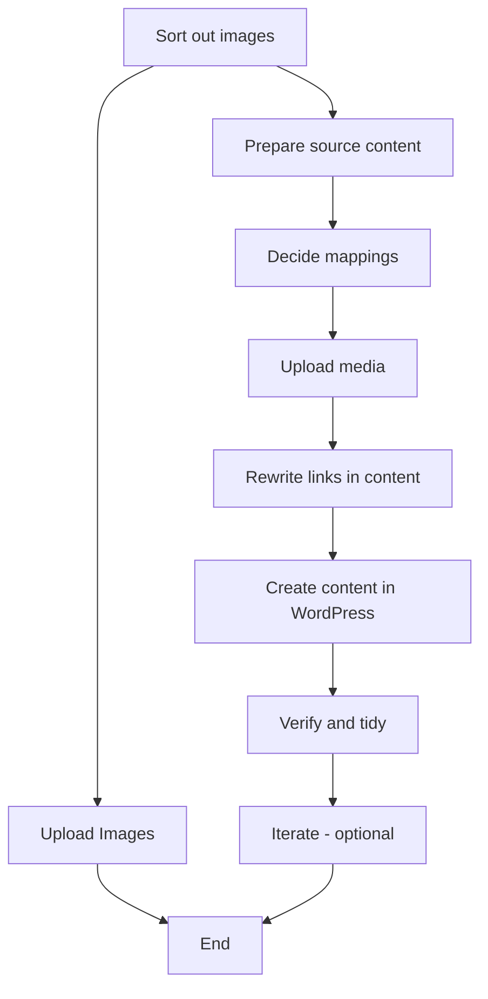

A migration tool (command line tool) to migrate our existing markdown material to WordPress in a fairly complex way.

## Context

We are migrating the **Life Itself website https://lifeitself.org/** to WordPress.

- The existing site contains a large volume of content (around 1,000 posts) along with images and other assets
- The content is stored in **GitHub at https://github.com/life-itself/lifeitself.org** and published with Flowershow (old self-hosted version)
- We need a migration script that can transfer posts and media into WordPress, upload images to the Media Library, relink them correctly within posts, and map existing metadata such as tags or taxonomies.
- The aim is to create a reliable, repeatable process that handles the scale and complexity of the migration while preserving content integrity.

## Spec (experiments)

So far, neither are great ... as a bit over-complex. Insight is to break down parts myself and then spec one part at a time and create that and then chain them together.

- SPEC v0.1 (ChatGPT)
- Spec v0.2 (Cursor)

## Design

We will structure the WordPress migration as an **ETL pipeline** with clear stages, where each step is isolated, produces defined outputs, and feeds into the next. This makes the process modular, testable, and easier to extend.

- Each step will live in its **own subfolder** (e.g. `/01-prepare`, `/02-mappings`, etc.) with a clear **`in/` and `out/`** directory.
- The **input of each step** is the **output of the previous step**.
- The **initial input** will be an externally specific folder. We can create an initial `sample/` folder with an example subset of Markdown + assets.
- Each step will include a **sub-README** describing its purpose, inputs, and outputs.
- Steps will be developed **one at a time**, tested independently before chaining.
- We will use prompt engineering (or scripts) at each step to ensure repeatable results.
- Open questions to resolve:
  - How to **orchestrate the steps** together into a full pipeline (make vs airflow vs prefect custom)?
  - What tooling/framework (if any) we use for orchestration and dependency handling.

### Steps

May still be missing some ...

0. Sort out images
1. Prepare source content
2. Decide mappings
3. Upload media
4. Rewrite links in content
5. Create content in WordPress
6. Verify & tidy
7. Iterate (optional, later)

---

### 0. Image processing

- [ ] Create dictionary of renaming image assets (based on file they are used in)

So in this step, we are looking through all the image assets, deciding if they need renaming. If they are renaming, and they use often image assets only used in one file, renaming based on that file in some useful way or context. Then saving them again and making probably a note of the rename. Like we need a list of the data of the rename because we're going to use that when we then go through all the other marked down files and update the links to the image assets at some point. And then there would be another step here which would probably be like uploading. I mean there might even just be a dictionary here. Like the output of the stage might actually only need to be a dictionary of renames because frankly you could do the rename when you do the upload. You don't need to store all the image files again and you just need to do the renaming. So the output of this stage would probably be a dictionary file of renames. And you know with the source name and then the target name. And then there would be a stage for actually doing the upload. There would be a code script for actually doing the upload to WordPress or whatever it is. That could even be a separate stage. Really it could be run separately. So yeah.

### 0.b Image uploading

This can happen at any stage actually (and in parallel)

- [ ] Uploading image assets

### 1. Prepare source content

- [ ] Clean up front-matter (titles, dates, slugs, tags)
- [ ] Fix/standardize Markdown
- [ ] Fixing wiki markdown links like `[[]]` which aren't fully qualified
- [ ] Locate broken links
- [ ] Updating links in markdown files to corrected image links

### 2. Decide mappings

- [ ] Map folders/files to WordPress types (post, page, etc.)
- [ ] Decide taxonomy use (tags/categories)
- [ ] Choose final permalink style (usually slug-based)

### 3. Upload media

- [ ] Upload all referenced images/files to the WP media library
- [ ] Record the final URLs/IDs

### 4. Rewrite links in content

- [ ] Replace local image paths with their WP media URLs
- [ ] Convert internal links to their final slugs/paths

### 5. Create content in WordPress

- [ ] Create posts/pages with title, slug, date, status, excerpt
- [ ] Set featured image where relevant
- [ ] Assign tags/categories

### 6. Verify & tidy

- [ ] Spot-check a sample: images display, links work, formatting looks right
- [ ] Add redirects for any old URLs if needed
- [ ] Generate a short report of anything to fix later

### 7. Iterate (optional, later)

- [ ] Add custom post types/fields if needed
- [ ] Improve images (sizes/WebP)
- [ ] Add richer blocks, embeds, or shortcodes

# Notes

## Things to cover

- [ ] Fixing wiki markdown links like `[[]]` which aren't fully qualified

## Inbox

- [ ] ➕2025-08-29 https://gitlab.com/obviate.io/hugo2wordpress/-/blob/main/hugo2wordpress.py - a sort of useful script
